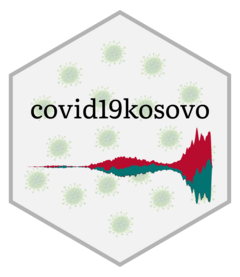

<!-- README.md is generated from README.Rmd. Please edit that file -->

# kosovomaps 

<!-- badges: start -->
<!-- badges: end -->

### Installation

You can install the released version of kosovomaps from GitHub:

``` r
# install.packages("devtools")
devtools::install_github("Kushtrimvisoka/kosovomaps")
```

### Basic Usage

#### 1) Load packages

``` r
library(kosovomaps)
library(tidyverse)
#> ── Attaching packages ─────────────────────────────────────── tidyverse 1.3.0 ──
#> ✓ ggplot2 3.3.2     ✓ purrr   0.3.4
#> ✓ tibble  3.0.4     ✓ dplyr   1.0.2
#> ✓ tidyr   1.1.2     ✓ stringr 1.4.0
#> ✓ readr   1.4.0     ✓ forcats 0.5.0
#> ── Conflicts ────────────────────────────────────────── tidyverse_conflicts() ──
#> x dplyr::filter() masks stats::filter()
#> x dplyr::lag()    masks stats::lag()
```

#### 2) Load the map of Kosovo - State level:

``` r
RepublicOfKosovo <- mapof(x = "state")
```

Plot an example:

``` r
ggplot(RepublicOfKosovo)+
  geom_sf()+
  theme_void()
```


#### 3) Load the map of Kosovo - Municipal level:

``` r
MunicipOfKosovo <- mapof(x = "municip")
```

Plot an example:

``` r
ggplot(MunicipOfKosovo)+
  geom_sf()+
  theme_void()
```


