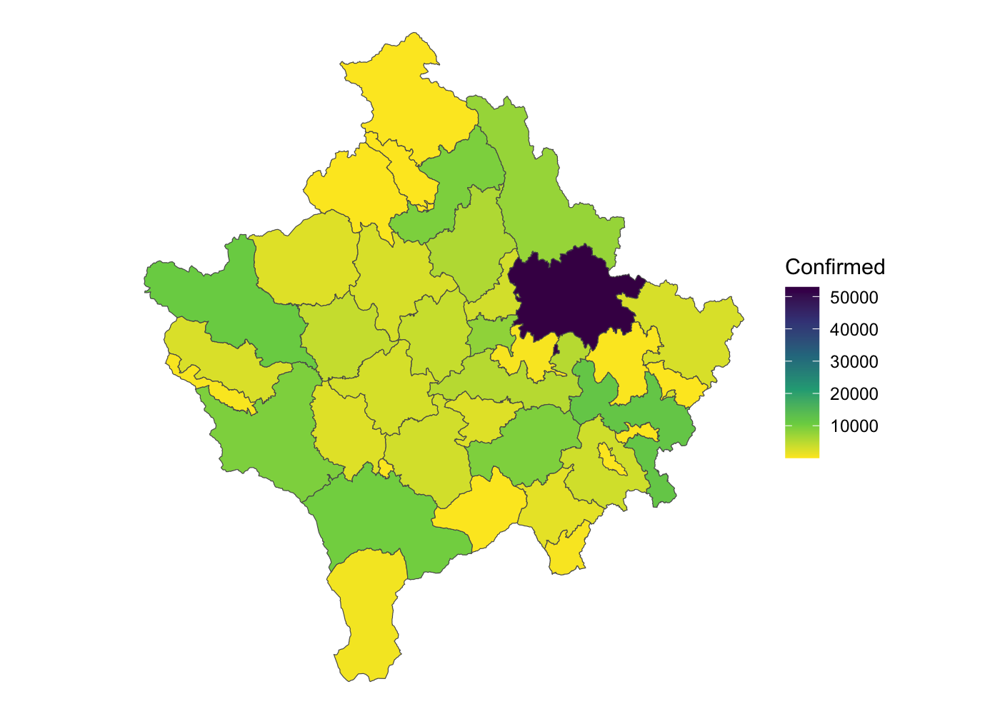

<!-- README.md is generated from README.Rmd. Please edit that file -->

# covid19kosovo 

<!-- badges: start -->
<!-- badges: end -->

The “covid19kosovo” R package provides the latest available public data
on Covid-19 situation in Kosovo.

Datasets:

- Daily summaries of confirmed, healed, and death cases on the national
  level.

- Daily summaries of confirmed cases by municipality.

- Daily summaries of confirmed cases by cadastral zone (village).

Official source: [IKSHPK Facebook
page](https://www.facebook.com/IKSHPK). I do not guarantee the accuracy
of the data presented in this R package.

## Installation

You can install the released version of ‘covid19kosovo’ from GitHub
with:

``` r
# install.packages("devtools)
devtools::install_github("Kushtrimvisoka/covid19kosovo")
```

## Example

``` r
library(covid19kosovo)
```

Daily summaries of confirmed, healed, and death cases on the national
level.

``` r
data <- covid19kosovo(level = "total") 
#> Downloading data from
#> https://raw.githubusercontent.com/Kushtrimvisoka/datasets/main/covid19kosovo_timeseries.csv...

head(data)
#>         date confirmed healed dead confirmed_cumulative healed_cumulative
#> 1 2020-03-13         2      0    0                    2                 0
#> 2 2020-03-14         3      0    0                    5                 0
#> 3 2020-03-15         3      0    0                    8                 0
#> 4 2020-03-16         7      0    0                   15                 0
#> 5 2020-03-17         4      0    0                   19                 0
#> 6 2020-03-18         1      0    0                   20                 0
#>   dead_cumulative active
#> 1               0      2
#> 2               0      5
#> 3               0      8
#> 4               0     15
#> 5               0     19
#> 6               0     20
```

Daily summaries of confirmed cases by municipality.

``` r
data <- covid19kosovo(level = "municipality") 
#> Downloading data from
#> https://raw.githubusercontent.com/Kushtrimvisoka/datasets/main/covid19kosovo_timeseries_municipality.csv...

head(data)
#>         date id municipality confirmed
#> 1 2020-03-13  8        Klinë         1
#> 2 2020-03-13 26         Viti         1
#> 3 2020-03-14 30    Malishevë         1
#> 4 2020-03-14 26         Viti         2
#> 5 2020-03-15 30    Malishevë         3
#> 6 2020-03-16 15       Obiliq         1
```

Daily summaries of confirmed cases by cadastral zone (village).

``` r
data <- covid19kosovo(level = "village") 
#> Downloading data from
#> https://raw.githubusercontent.com/Kushtrimvisoka/datasets/main/covid19kosovo_timeseries_cz.csv...

head(data)
#>         date id municipality    cadastral_zone confirmed
#> 1 2020-03-13  8        Klinë         Dranashiq         1
#> 2 2020-03-13 26         Viti Stubëll e Poshtme         1
#> 3 2020-03-14 30    Malishevë           Bubavec         1
#> 4 2020-03-14 26         Viti Stubëll e Poshtme         2
#> 5 2020-03-15 30    Malishevë           Bubavec         1
#> 6 2020-03-15 30    Malishevë     Llashkadrenoc         1
```

Daily vaccination process

``` r
data <- vaccination()
#> Downloading data from
#> https://raw.githubusercontent.com/Kushtrimvisoka/datasets/main/kosovo_dailyvaccinations.csv...

head(data)
#>         date daily_vaccinated one_dose two_doses three_doses total_doses
#> 1 2021-05-30             1120       NA         0          NA       64776
#> 2 2021-05-31             2318       NA         0          NA       67094
#> 3 2021-06-01             2595       NA         0          NA       69686
#> 4 2021-06-02             2955       NA         0          NA       72637
#> 5 2021-06-03             2915       NA         0          NA       75553
#> 6 2021-06-04             2922       NA         0          NA       78477
```

## Map - Confirmed cases by municipality

``` r
library(tidyverse)
#> ── Attaching packages ─────────────────────────────────────── tidyverse 1.3.2 ──
#> ✔ ggplot2 3.4.0      ✔ purrr   1.0.0 
#> ✔ tibble  3.1.8      ✔ dplyr   1.0.10
#> ✔ tidyr   1.2.1      ✔ stringr 1.5.0 
#> ✔ readr   2.1.3      ✔ forcats 0.5.2 
#> ── Conflicts ────────────────────────────────────────── tidyverse_conflicts() ──
#> ✖ dplyr::filter() masks stats::filter()
#> ✖ dplyr::lag()    masks stats::lag()
library(sf)
#> Linking to GEOS 3.10.2, GDAL 3.4.2, PROJ 8.2.1; sf_use_s2() is TRUE
# devtools::install_github("Kushtrimvisoka/kosovomaps")
library(kosovomaps)
library(covid19kosovo)

rksmap <- mapof("municip")
  
data <- covid19kosovo(level = "municipality") %>% 
  group_by(id, municipality) %>% 
  summarise(confirmed = sum(confirmed))
#> Downloading data from https://raw.githubusercontent.com/Kushtrimvisoka/datasets/main/covid19kosovo_timeseries_municipality.csv...
#> `summarise()` has grouped output by 'id'. You can override using the `.groups` argument.

rksmap <- merge(rksmap, data)

p <- ggplot()+
  geom_sf(data = rksmap, aes(fill = confirmed)) +
  scale_fill_viridis_c("Confirmed", direction = -1) +
  theme_void()

p
```


